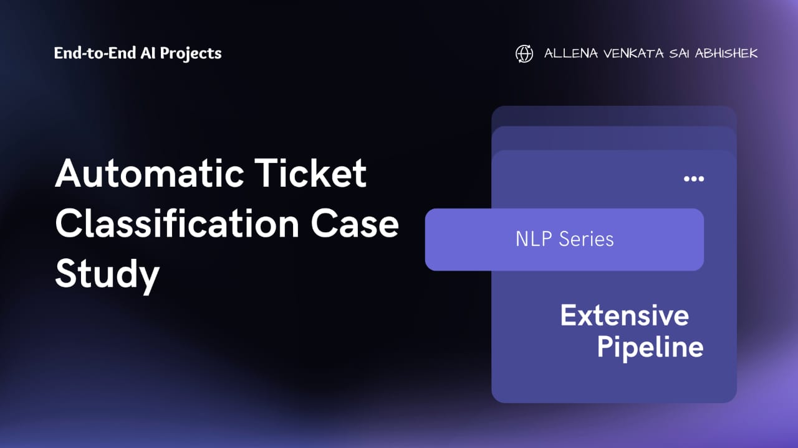

# Data Scientist

#### Technical Skills: Python, SQL, Machine Learning, Natural Language Processing, Generative AI

## Education	
- Excutive PG Diploma., Data Science and AI | IIIT Bengaluru(_MAY 2025_)
- M.Sc., Physics	|Bengaluru North University at Kolar(_Dec 2023_)			        		
- B.Sc., Physics | Bengaluru North University at Kolar(_Dec 2021_)
  
## Work Experience

I’m a data science enthusiast with a solid academic foundation and hands-on project experience in Machine Learning, NLP, and Generative AI.  
I previously worked as a Physics Lecturer for a year, which sharpened my analytical thinking and communication skills — both critical in solving data-driven problems.

I’m currently focused on building real-world solutions using Python, MySQL, and GenAI, while actively learning Deep Learning and NoSQL technologies.

## 🚀 Projects

### 🚲 Bike Sharing Demand Prediction
[GitHub Repo](https://github.com/PrathiPanthera/Bike_sharing)

Built a multiple linear regression model to predict hourly bike rental demand using features like temperature, humidity, and time variables.  
Performed exploratory data analysis, feature engineering, and statistical diagnostics to build a robust predictive model using **Python**, **Pandas**, and **Scikit-learn**.

---

### 🎯 Lead Score Case Study
[GitHub Repo](https://github.com/PrathiPanthera/Lead_score_case_study)

Developed a logistic regression model to assign conversion scores to marketing leads based on their behavior and demographics.  
Implemented feature selection, multicollinearity reduction, and threshold tuning to optimize classification performance.  
Delivered insights to improve conversion rates from 30% to over 70%.

---

### 📉 Telecom Churn Prediction
[GitHub Repo](https://github.com/PrathiPanthera/Telecom_churn-)

Built a classification model to predict customer churn using telco usage patterns and demographics.  
Applied EDA, outlier handling, feature transformation, and logistic regression.  
Evaluated with metrics like ROC-AUC, precision-recall, and confusion matrix for stakeholder interpretability.

---

### 🧠 Insurance RAG Chatbot (HelpMate AI)
[GitHub Repo](https://github.com/PrathiPanthera/RAG_chatbot)

Built a Retrieval-Augmented Generation chatbot for the insurance domain using **LangChain**, **OpenAI API**, and **ChromaDB**.  
Processed real insurance PDFs, chunked and embedded them, and used a re-ranking layer to optimize document retrieval.  
Engineered a prompt + query engine pipeline for high-quality, context-aware responses.

---

### 🏪 Rossmann Store Sales Forecasting
[GitHub Repo](https://github.com/PrathiPanthera/Sales_forecasting)

Forecasted daily sales for Rossmann stores using time series modeling and regression techniques.  
Performed data preprocessing, feature engineering (e.g., holidays, promotions), and built models using **XGBoost** and **Prophet**.  
Final model captured sales seasonality and store-level behavior for better inventory planning.

---

### 🎟️ Automatic Ticket Classification
[GitHub Repo](https://github.com/PrathiPanthera/Automatic_ticket_classification)

Developed an NLP-based classifier to automatically categorize customer support tickets using TF-IDF feature extraction and models like Logistic Regression and Naive Bayes.  
Included text preprocessing (tokenization, lemmatization), model tuning, and evaluation with accuracy, confusion matrix, and classification report.  
Enabled faster ticket routing and reduced manual triage efforts.

